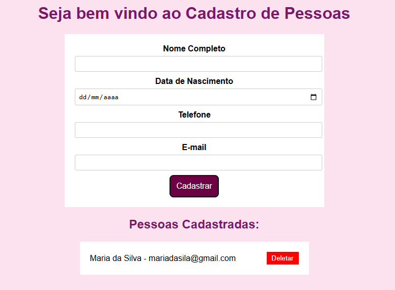

# 👤 Cadastro de Pessoas utilizando JavaScript e LocalStorage

<div align="justify">

## 📄 Descrição
Este projeto é uma aplicação simples para cadastrar pessoas, utilizando **JavaScript** e o armazenamento local do navegador (**localStorage**). Ele permite realizar as operações básicas de **criação**, **listagem** e **remoção** de cadastros. A interface é baseada em HTML, CSS e JavaScript.

## 🔧 Funcionalidades

- **Cadastro de Pessoas**: O usuário pode preencher um formulário com nome, data de nascimento, telefone e e-mail. Ao submeter, os dados são salvos no `localStorage`.
- **Listagem de Pessoas**: A lista de pessoas cadastradas é exibida na tela, permitindo visualizar o nome e e-mail.
- **Deleção de Pessoas**: Cada pessoa cadastrada possui um botão de "Deletar" para remover o registro individualmente da lista e do `localStorage`.

## 📖 Como Utilizar

1. Clone este repositório para o seu computador:
   ```sh
   git clone https://github.com/RobertakOliveira/CadastrodePessoasComLocalStorage.git
   ```
2. Abra o arquivo `index.html` no navegador para utilizar a aplicação.
3. Para visualizar as pessoas cadastradas no `localStorage`, abra as **ferramentas de desenvolvedor** do navegador (F12 ou clique com o botão direito > Inspecionar), acesse a aba **Application** e selecione `Local Storage`.

## ⚙️ Tecnologias Utilizadas

- **HTML**: Estrutura do formulário e da lista de pessoas.
- **CSS**: Estilização da interface.
- **JavaScript**: Manipulação do DOM, interação com o formulário e `localStorage`.

## 🖥️ Tela Principal

<p align="center">
  
</p>

```plaintext
📁 CadastroPessoasComLocalStorage
│── 📂 css
│   └── 🎨 style.css
│── 📂 javascript
│   └── 📜 arquivo.js
│── 📜 .gitignore
│── 📄 index.html
│── 📄 README.md
│── 🖼️ TelaPrincipal.png
 ```
## 🔍 Passo a Passo da Implementação

### 1. Estrutura HTML
Criamos o arquivo `index.html`, que contém um formulário para cadastrar as pessoas e uma lista onde os registros são exibidos. O formulário possui campos para o nome, data de nascimento, telefone e e-mail.

### 2. Armazenamento no LocalStorage
Utilizamos as funções `localStorage.setItem()` para armazenar e `localStorage.getItem()` para recuperar os dados. Dessa forma, os dados ficam salvos mesmo após o navegador ser fechado.

### 3. Criação da Função `criarPessoa()`
Essa função recebe os dados do formulário e retorna um objeto representando a pessoa. Utilizamos **arrow functions** para simplificar o código.

### 4. Manipulação do LocalStorage
- **`obterPessoas()`**: Busca as pessoas armazenadas no `localStorage`. Caso não haja registros, retorna um array vazio.
- **`salvarPessoa()`**: Adiciona um novo objeto pessoa à lista no `localStorage`.
- **`removerPessoa()`**: Remove um registro pelo e-mail e atualiza a lista.

### 5. Atualização da Lista no DOM
A função `atualizarLista()` exibe a lista de pessoas cadastradas na página. Cada item possui um botão "Deletar" para remoção.

### 6. Interação com o Formulário
O evento `submit` captura os dados preenchidos pelo usuário e os armazena chamando `salvarPessoa()`. Após a inserção, o formulário é resetado e a lista é atualizada.

### 7. Remoção de Pessoas
Cada pessoa na lista tem um botão de "Deletar". Quando clicado, a função `removerPessoa()` é chamada, e a lista é atualizada automaticamente.

## 👩‍💻 Autor(a)
- **Roberta Kamilly Magalhães de Oliveira**: Criadora e desenvolvedora principal deste projeto.

</div>

